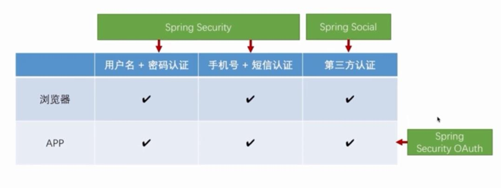
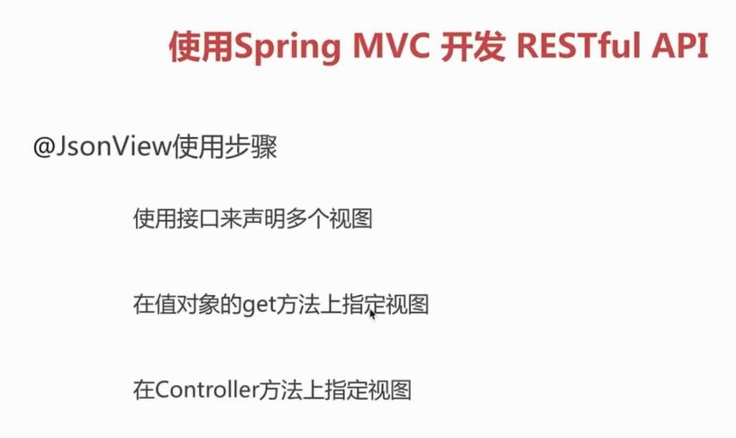
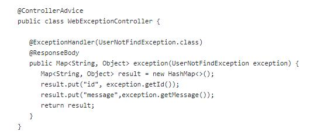
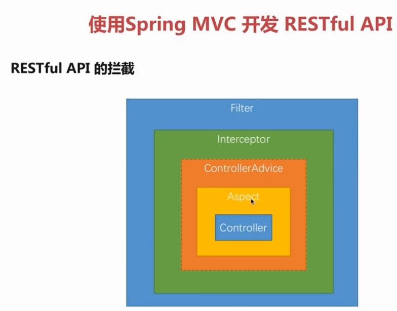

* 认证方式
    * SpringSecurity提供的认证（浏览器:是基于服务器Session的方式进行认证）   
        * 用户名密码认证 
        * 手机验证码认证
    * SpringSocial认证（浏览器）
        * 第三方认证：微信、qq登陆
    * Spring Security OAuth（App认证：由于App请求的时候每次都会创建一个新的Session、无法使用服务器的Session进行认证、所以采用token认证）
        * App基于上面三种的认证

* Restful API
    * 用URI描述资源：不管是GET、PUT请求都是用一样的URI，URI中携带要操作的对象（例如id），所以是标识一种资源.
    * 用请求行为描述各种行为（GET描述查操作、POST描述增操作...）、使用返回状态码表示访问的状态
    * 使用JSON格式进行交互
* 使用JsonView，在某个接口中对于一个对象不想显示出来的字段来做显示

* 对于日期类型的处理方式：由于后端接口可能会被Browser和App调用，如果限制传输的格式的话，可能无法适应需求。所以向后端传输日期值的时候传输**时间戳**
即可，后端根据自己的需求进行格式的转换即可.后端使用Date类型进行接收即可.
* 对于字段进行校验：Hibernate validator
    * 方法一：这种在不匹配校验规则的时候不会进入到方法体中，这种如果要在发生不匹配的时候记录一些日志的话无法实现
        * 在要校验的字段上加@NotBlank
        * 在接口的形参中前面加上@Valid即可实现非空校验
    * 方法二：由于上面的不足，所以在原来的基础上，在接口的形参上增加一个BindingResult对象，通过if (bindingResult.hasErrors())在方法中判断
    是否发生校验异常，即可以进行日志记录.
* SpringBoot的错误处理机制
    * 在默认的处理机制中，在controller中抛出异常的时候，会把对应的错误信息携带在一个Json对象中，返回给客户端。在Browser中调用的时候会显示
    默认的错误页面。
    * 如果要使用自己自定义的错误页面，那么可以在src/main/resources下创建resource/error文件，创建404.html即可处理404请求.在App请求的时候只会
    返回相对的错误信息的Json对象，处理这个对象即可.
    * 对于自己处理返回错误信息、使用@ControllerAdvice注解@ExceptionHandler来处理即可.

* Spring的过滤器、拦截器、AOP
    * Filter:**只能获取请求的Request和Response，Filter是j2ee的规范，所以无法知道请求要调用的方法是什么，因为这是Spring框架的内容**
        * 方法一：使用@Component注解
            * 实现Filter接口：doFiter方法中在调用对应的方法前后都会被执行.
            * 声明@Component即可.所有的请求都会经过这个Filter.
        * 方法二：对于第三方的Filter的添加
            * 创建一个FilterRegistrationBean对象
            ---
            <pre><code>@Configuration
            public class WebConfig {
               /**
                * 对于那些第三方法的Filter添加的时候无法再Filter类上直接添加@Component注解，只能这样去模拟在web.xml中添加一个Filter
                * 创建一个FilterRegistrationBean对象，添加一个Filter，可以定义过滤的URL
                * @return
                */
               @Bean
               public FilterRegistrationBean registrationBean(){
                  FilterRegistrationBean filterRegistrationBean = new FilterRegistrationBean();
                  CustomFilter customFilter = new CustomFilter();
                  filterRegistrationBean.setFilter(customFilter);
                  List<String> urls = new ArrayList<>();
                  urls.add("/*");
                  filterRegistrationBean.setUrlPatterns(urls);
                  return filterRegistrationBean;
               }
            }</code></pre>
            ---
*
    * Interceptor:**对于Interceptor来说，可以获取请求的方法,如果在调用方法时候抛出异常，而且刚好有声明@ControllerAdvice这个注解来处理方法
    出现异常时对异常的捕获操作并且消费掉Exception的时候，那么在Interceptor中的afterCompletion中不会在捕获到异常。因为afterCompletion排在
    @ControllerAdvice的后面**
        * 实现HandlerInterceptor.**postHandle在方法出现异常的时候不会被调用、afterCompletion不管是否出现异常都会被调用、可以获取对应异常**
        * 实现WebMvcConfigurerAdapter，把Interceptor添加进去即可.
        ---       
        <pre><code>@Configuration
         public class WebConfig extends WebMvcConfigurerAdapter{
            @Resource
            private WebInterceptor webInterceptor;
            public void addInterceptor(InterceptorRegistry interceptorRegistry) {
                interceptorRegistry.addInterceptor(webInterceptor);
            }
         }</code></pre>
        ---
    * AOP：能获取调用方法参数的具体的值，这个在Interceptor中是无法做到的.(切面)
        * 切入点（注解)
            * 在什么方法上起作用
            * 在什么时候起作用.在方法执行之前、执行之后、抛出异常的时候等.
        * 增强（方法）：在起作用的时候执行的业务逻辑
        ---
        <pre><code>//切面
         @Aspect
         @Component
         public class WebAspect {
             //切点：1、@Around在什么时候执行
             //2、execution在什么地方执行
             // @throws Throwable 
            @Around("execution(* com.aia.controller.PageController.*(..))")
            public Object aspect(ProceedingJoinPoint pjp) throws Throwable {
               System.out.println("AOP之前");
               Object[] args = pjp.getArgs();
               pjp.proceed();
               System.out.println("AOP之后");
               return null;
            }
         }</code></pre>
        ---

        
    
